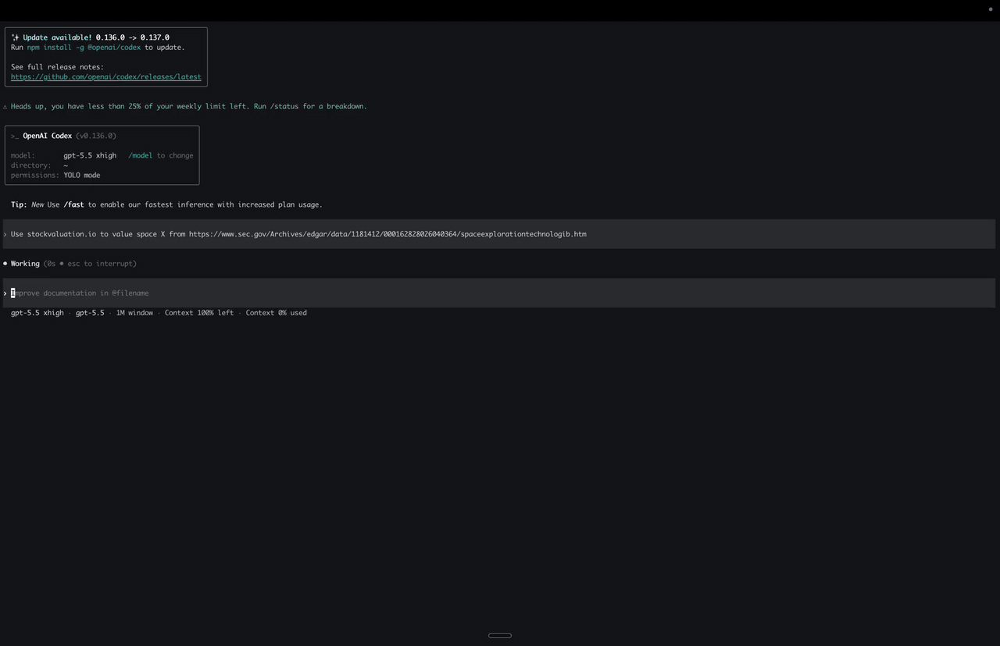

# StockValuation.io

StockValuation.io gives Codex and Claude a local valuation workflow.

Your agent can research a company, gather evidence, ask valuation questions, and write an educational report. The local service runs the DCF math and returns auditable numbers.

> Educational use only. This is not financial advice.

## Demo

[](docs/media/googl-codex-valuation-demo.mp4)

The demo shows Codex CLI using the local StockValuation.io prospectus workflow for SpaceX. Codex reviews extracted filing evidence, asks guided valuation questions, and produces an educational valuation view.

## Why this exists

I built this because I wanted an AI workflow that respects valuation discipline.

In a Damodaran-style valuation, the final value matters less than the chain from business story to assumptions to cash flows. If growth goes up, the model should show the revenue path. If margins expand, the report should explain why. If reinvestment falls, the user should see the capital-efficiency claim behind it.

An agent can help with reading filings, comparing sources, summarizing a business, and pressure-testing a story. It should not invent hidden numbers or hand-calculate a fair value.

StockValuation.io keeps those jobs separate. The agent handles research and explanation. The local tools handle valuation math. You inspect the assumptions and decide which scenario deserves trust.

## The problem

DCF valuation looks simple on paper. The hard part sits in the inputs:

- revenue growth
- operating margin
- reinvestment
- risk
- terminal value
- capital structure

Small input changes can move the valuation a lot. When a tool hides those assumptions, you cannot tell whether the output came from evidence, judgment, or a model shortcut.

StockValuation.io makes the assumptions visible. It asks guided questions for the material drivers, recalculates scenarios through the local service, and marks weak valuation cases instead of pretending they are ready.

## How the workflow splits responsibility

Your agent handles:

- company research
- filing review
- evidence gathering
- business and segment summary
- guided valuation questions
- scenario explanation
- the final educational report

The local valuation tools handle:

- baseline valuation
- DCF math
- scenario recalculation
- growth anchors
- reference-data status
- effective assumptions
- source checks
- data-quality warnings
- clear failures

You handle:

- assumption review
- scenario selection
- final judgment

The agent should call the local tools for valuation output. It should not hand-calculate valuation numbers.

## What you get

- A `stockvaluation.io` skill for Codex and Claude.
- Local MCP tools for valuation workflows.
- Docker services for the valuation runtime.
- Deterministic DCF math and scenario recalculation.
- Baseline values, growth anchors, reference-data status, and effective assumptions.
- A researched flow that pauses for evidence review.
- Guided valuation questions before the final report.
- Failure messages when the data cannot support a valuation.

## Use it for

- Learning valuation.
- Reviewing DCF assumptions.
- Connecting a business story to numbers.
- Comparing valuation scenarios.
- Running an inspectable local workflow with Codex or Claude.
- Building and testing an agent-native valuation stack.

## Do not use it for

- Financial advice.
- Buy, sell, or hold recommendations.
- Personalized investment decisions.
- Guaranteed fair values.
- A hosted stock-picking app.
- A fully local LLM stack.

This project does not know your goals, risk tolerance, portfolio, or financial situation.

## Damodaran-style method

This project follows the Damodaran practice of tying story to numbers.

If the story says a company can grow fast, the numbers need to show revenue growth, margin progress, reinvestment needs, and risk. If the numbers imply an impossible story, the agent should challenge the assumptions.

The output is an argument you can inspect. It is not a claim that the market price is wrong.

Aswath Damodaran does not endorse this project, and I have no affiliation with him.

## How a valuation run works

The default flow uses questions. It does not produce a one-shot report unless you ask for that path.

1. The agent checks that the local valuation tools are running.
2. The agent gets a deterministic baseline from the local service.
3. The agent researches the company and gathers evidence for the main valuation drivers.
4. The agent pauses so you can review the evidence.
5. The agent asks guided valuation questions.
6. The local service recalculates scenarios.
7. The agent writes the final educational report.

Ask for a quick run only when you want to skip the evidence and question loop.

## Quick start

You need Docker Desktop or a compatible Docker Engine with Compose.

From a local checkout:

```bash
./install.sh setup
```

Or run the installer from GitHub:

```bash
curl -fsSL https://raw.githubusercontent.com/stockvaluation-io/stockvaluation_io/main/install.sh | bash -s -- setup
```

Setup installs or updates the skill, configures the local tools, starts the Docker services, and prints service status. The installer targets Codex and Claude by default.

The curl installer clones the repo to `~/.local/share/stockvaluation_io` by default. Set `STOCKVALUATION_INSTALL_DIR=/path/to/dir` to choose another location.

Useful commands:

```bash
./install.sh status
./install.sh start
./install.sh stop
./install.sh uninstall
```

The installer runs the local valuation stack through `docker-compose.local.yml`.

## Use it from Codex or Claude

After setup, ask your agent for a valuation:

```text
Value MSFT using stockvaluation.io.
Value GOOGL using stockvaluation.io.
Value META using stockvaluation.io.
```

For the default researched flow, expect the agent to show evidence first, ask guided assumption questions, and write the report after you answer.

## Prospectus valuations

You can also ask for a valuation from an SEC prospectus filing:

```text
Use stockvaluation.io to value a company from this SEC prospectus: <SEC EDGAR HTML URL>
```

The workflow extracts filing facts, asks you to review the evidence, and then asks for the assumptions that drive the valuation. If the filing lacks enough support, the tool should return a clear warning or failure instead of a polished number.

## Local-first, not fully offline

The valuation services and DCF math run on your machine.

Some inputs still come from outside your machine:

- market data
- company filings
- currency data
- web research
- the model provider used by your agent

This repo does not ship a fully local LLM stack.

## Limits

- Public filings and market-data providers control data coverage.
- The workflow may use normalized fallback data when primary filing data is missing or unsupported.
- Valuation can fail when upstream data is missing, stale, low quality, or unsuitable for the model.
- Historical coverage has gaps.
- Non-US, ADR, IFRS, and unusual filing cases may need extra source review.
- The service does not support financial-sector companies.
- The service should return a clear failure for unsupported companies.
- Growth anchors and reference data support critique. They do not prove the value.
- DCF outputs move with assumptions.
- Guided-question defaults are modeling defaults. They are not investment recommendations.

A clear failure beats a fake valuation.

## Security and no-advice rules

- Keep local services on your machine unless you know how to secure them.
- Treat every report as educational material.
- Avoid buy, sell, hold, target-price, and personalized recommendation language.
- Review every material assumption before trusting a scenario.

## Citation

```text
@misc{stockvaluation_io,
  author = {Pradeep Singh},
  title = {StockValuation.io: Local stock valuation tools for Codex and Claude},
  year = {2026},
  publisher = {GitHub},
  url = {https://github.com/stockvaluation-io/stockvaluation_io}
}
```

## Acknowledgments

Core methodology and reference data draw on Aswath Damodaran's public valuation resources:

- https://pages.stern.nyu.edu/~adamodar/New_Home_Page/data.html

This project is not affiliated with or endorsed by Aswath Damodaran. Educational use only.
